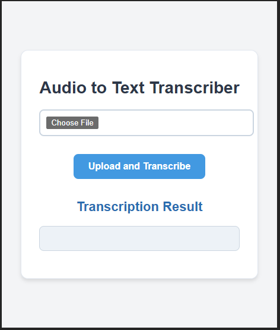
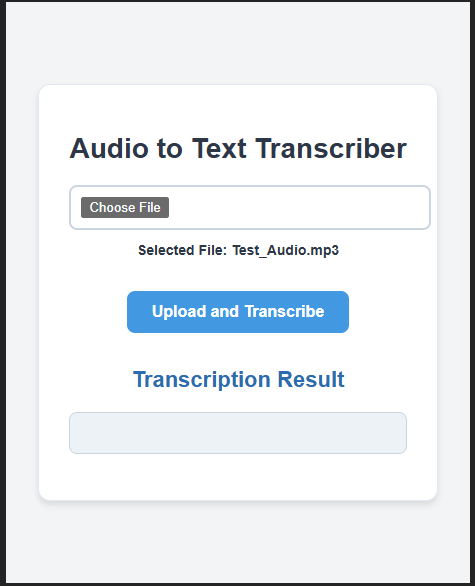
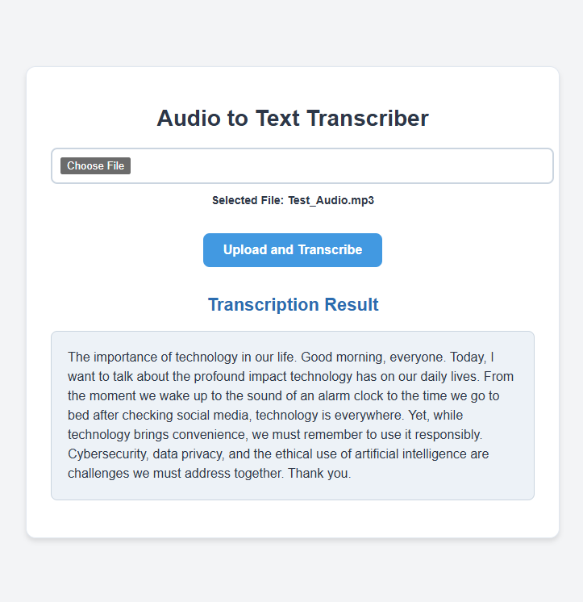

# Audio Transcriber App

This is an AI-powered Audio Transcription App that converts audio files into text seamlessly. The app leverages OpenAI's advanced transcription capabilities through a robust Spring Boot backend and provides an intuitive user experience with a modern React-Vite frontend.

## Tech Stack

- **Frontend**: React-Vite, JavaScript, CSS
- **Backend**: Java Spring Boot, OpenAI API, Maven

## Application Workflow

### **1. Home Screen**
This is the main screen of the app where users can upload audio files for transcription.

### **2. File Selection**
Once a file is chosen, its name is displayed below the input field.

### **3. Transcription Result**
The uploaded audio file is processed, and the transcription result is displayed in a styled box.

## Connect with me 

**Kanika Mathur**  
- [E-mail](mkanika.90@gmail.com)
- [GitHub](https://github.com/KanikaGenesis)  
- [LinkedIn](https://www.linkedin.com/in/kanika-mathur-083080121)  

